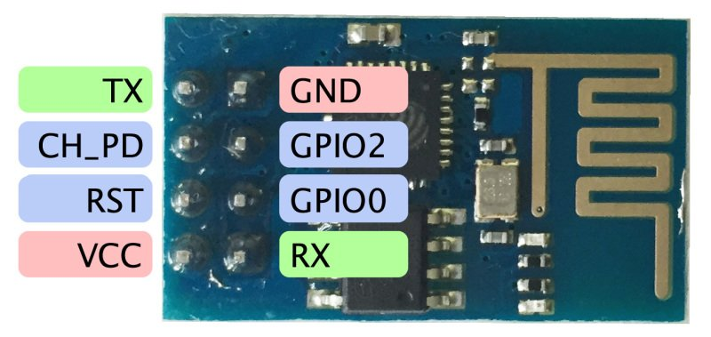

## What you'll need:
### Download from library manager (Tools > Manage Libraries)
* Mqtt (https://github.com/256dpi/arduino-mqtt)
* PubSubClient (https://github.com/knolleary/pubsubclient)

### Docs
* [Pubsub docs](https://pubsubclient.knolleary.net/api.html)

### Hardware
* Esp8266
* <b>Separate power supply 3.3v for esp8266</b>
* Arduino
* 5v to 3.3v logic converter (or 1k and 2k resistors)



## Connect

```
Vcc -> 3.3V
CH_PD ->3.3V
RST -> 3.3V
GPIO 0 -> 3.3V via a resistor (anything between 1K & 10K)
GPIO 2 -> 3.3V via a resistor (anything between 1K & 10K)
GND -> GND
Tx -> Tx (with arduino as Tx is realy Rx)
Rx -> Rx (with arduino as Rx is realy Tx)
```

### First, I've flashed AiThinker firmware v 1.1.1
+ RST to 3.3V 
+ GPIO_0 to GND
+ To go into flash mode hold reset button and unplug-plug the esp module.
+ Then open MCU flasher and flash bin file
+ Reset
+ RST to None, GPIO_0 to 10k 3.3v
+ Set baud to 115200 and check AT commands. 
`AT` should return `OK` , `AT+GMR` should return current firmware version

### Change baud rate of esp to 9600
`AT+UART_DEF=9600,8,1,0,0` Should receive `OK`

### Final check
Change baud rate of serial monitor to 9600 and type `AT`. Should receive `OK`.

That is it, esp module is ready to be connected with Arduino

## Very useful 
* https://esp8266.ru/esp8266-podkluchenie-obnovlenie-proshivki/
* https://www.allaboutcircuits.com/projects/update-the-firmware-in-your-esp8266-wi-fi-module/
* https://sonyarouje.com/2016/03/15/mqtt-communication-with-arduino-using-esp8266-esp-01/
* https://www.hackster.io/user16726/configuring-the-esp8266-using-an-arduino-0ab2e6

